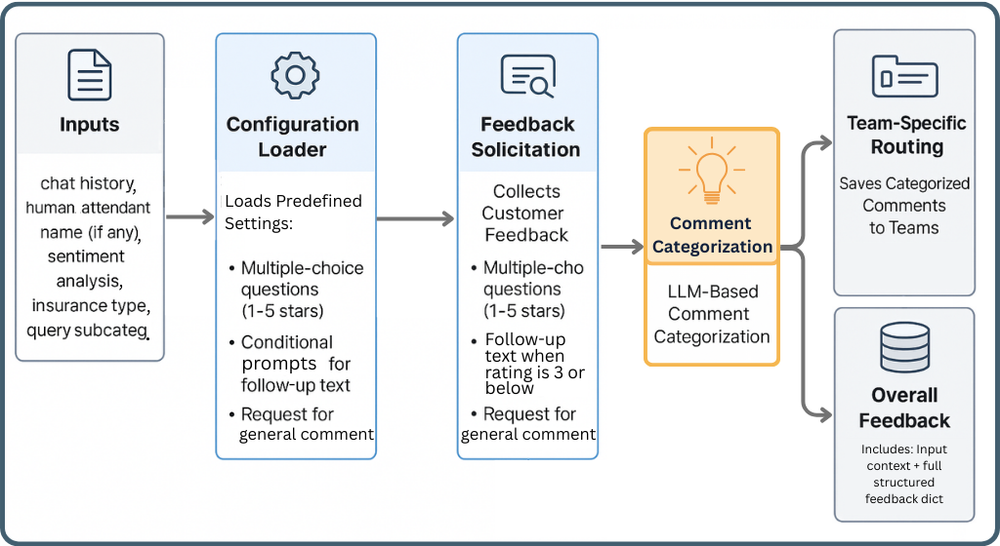
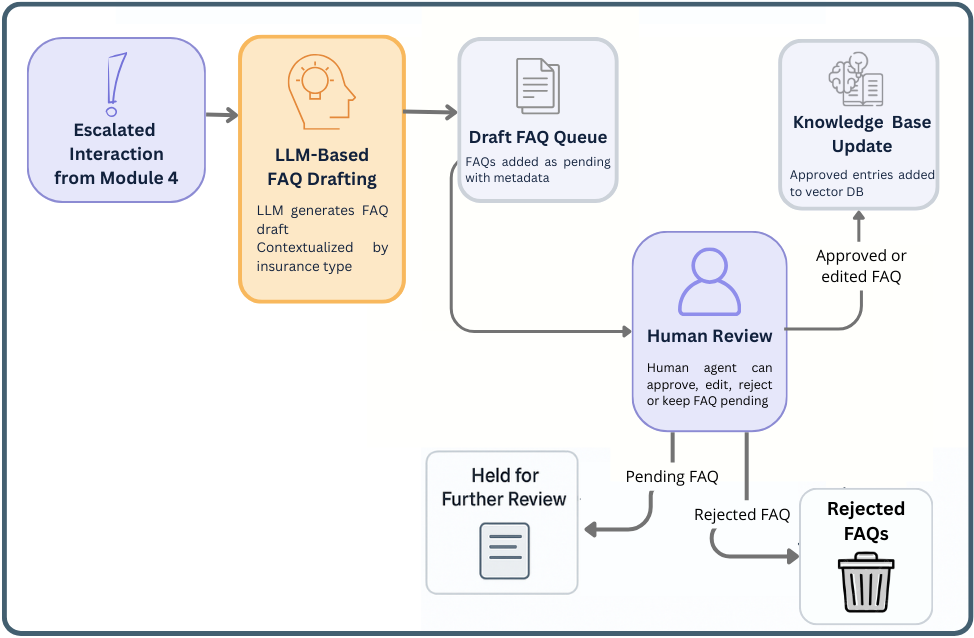

# STELLAR 🌟: A Structured Architecture for Reliable LLM Customer Support

[](https://opensource.org/licenses/MIT)

Welcome to the official implementation of **STELLAR (Structured, Trustworthy, and Explainable LLM-Led Architecture for Reliable Customer Support)**! This repository contains the core code, experimental setup, and resources described in our upcoming paper [Link to Paper when available].

STELLAR addresses the critical challenges of reliability, explainability, and consistency when deploying Large Language Models (LLMs) for complex customer support tasks. Instead of relying on unpredictable monolithic LLMs or overly flexible agentic frameworks, STELLAR proposes a robust **Directed Acyclic Graph (DAG)** architecture.


<br><em>(High-level overview of the STELLAR architecture in DAG, showing all modules and the possible transitions between them, which result in the 11 predefined workflows.)</em>

---

## 🚀 What is STELLAR?

STELLAR is a blueprint for building next-generation intelligent customer support systems. It leverages the power of LLMs within a structured, modular framework designed for:

*   ✅ **Reliability & Predictability:** Enforced by the DAG structure and predefined workflows.
*   🔍 **Explainability & Traceability:** Clear paths make debugging and auditing easier.
*   ⚖️ **Balanced Integration:** Combines LLM innovation (classification, generation, verification) with practical needs (RAG, Human-in-the-Loop) and ethical safeguards (compliance checks).
*   🛠️ **Modularity:** Composed of 9 distinct, specialized modules.
*   📈 **Continuous Improvement:** Features a semi-automatic knowledge base building loop.

---

## ✨ Key Features

*   **DAG Architecture:** Provides control, prevents infinite loops, and ensures predictable flow.
*   **9 Specialized Modules:** Each handles a specific task (Classification, RAG, Direct Info Retrieval, Escalation, Sentiment, Feedback, Knowledge Building, Verification, Compliance).
*   **11 Predefined Workflows:** Explicitly defined paths based on initial query type and runtime decisions.
*   **Multi-Pathway Design:** Efficiently routes queries to FAQ, Direct Info, or Human Escalation paths.
*   **LLM-Powered Innovation:** Uses LLMs for few-shot classification, re-ranking, context-aware verification, compliance checks, summarization, and draft generation.
*   **Practical Integration:** Incorporates Hybrid Search RAG (Module 2) and Human-in-the-Loop processes (Modules 4 & 7).
*   **Embedded Safety:** Includes robust compliance checking (Module 9) and user verification steps (Module 8).
*   **Semi-Automatic Improvement:** Module 7 facilitates knowledge base growth based on unresolved queries.
*   **Detailed Experimentation:** Includes code and data to reproduce module evaluations.

---

## 🏗️ Architecture Overview

STELLAR's core is its DAG structure, orchestrating 9 distinct modules:

1.  **Inquiry Classifier:** Routes initial queries.
2.  **FAQ Retrieval (RAG):** Answers questions using a knowledge base.
3.  **Direct Information Retrieval:** Uses in-context learning for static data.
4.  **Human Support Escalation:** Manages handover to human agents, including urgency scoring.
5.  **Sentiment Analysis:** Gauges user sentiment.
6.  **Feedback Collector:** Gathers and categorizes user feedback.
7.  **Knowledge Base Builder:** Semi-automatically suggests new FAQs.
8.  **Interaction Verification:** Confirms resolution with the user contextually.
9.  **Compliance Checker:** Validates LLM responses before they reach the user.

The system follows one of 11 predefined workflows based on decisions at key branching points (Modules 1, 8, 9), ensuring controlled execution.


<br><em>(Simplified illustration highlighting the three main initial paths (triggered by Module 1: Routing) and the role of Modules 8 (User Verification) and 9 (Compliance Verification) as key decision and flow divergence points)</em>

---

## 📁 Repository Structure
```
├── README.md <-- You are here!
└── STELLAR/
├── STELLAR.ipynb <-- Main notebook to run/demonstrate STELLAR workflows
├── experiments/
│ ├── experiments.ipynb <-- Notebook to reproduce module evaluations
│ └── test_cases/ <-- JSON files with test data for each module
│ └── vector_databases/ <-- Pre-built ChromaDB instances for RAG experiments
├── human_agents/
│ └── human_agents.json <-- Example roster of human agents for Module 4
├── images/ <-- Diagrams of the architecture and modules
├── logs/ <-- Directory for storing runtime workflow logs
├── outputs/ <-- Directory for outputs generated by modules (feedback, drafts, etc.)
│ ├── module_4/
│ ├── module_6/
│ ├── module_7/
│ └── module_9/
└── requirements/ <-- Configuration files, prompts, and knowledge bases
├── module_1/ <-- Prompts for Classifier
├── module_2/ <-- FAQs, Prompts, Vector DB for RAG
├── module_3/ <-- Contact Info Corpus, Prompts for Direct Info
├── module_4/ <-- Weights, Prompts for Escalation
├── module_6/ <-- Configs, Prompts for Feedback
├── module_7/ <-- Prompts for KB Builder
├── module_8/ <-- Prompts for Verification
└── module_9/ <-- Prompts for Compliance
```

---

## ⚙️ Getting Started

### Prerequisites

*   Python 3.8+
*   Jupyter Notebook or compatible environment
*   API Keys for LLM providers (e.g., Groq, OpenAI, Anthropic, hosted models via endpoints like Ollama/vLLM). By default, notebooks are configured to run using Groq. However, you can change this to use your preferred provider.

### Installation

1.  **Clone the repository:**
    ```bash
    git clone https://github.com/Matheus-F-Scatolin/STELLAR.git
    cd STELLAR
    ```

### Running STELLAR

Open and run the `STELLAR/STELLAR.ipynb` notebook. This notebook will guide you through:
*   Loading the necessary configurations and modules.
*   Simulating user queries.
*   Observing how queries are processed through the different workflows based on module outputs.
*   Seeing the final outputs and generated logs.

### Running Experiments

Open and run the `STELLAR/experiments/experiments.ipynb` notebook. This notebook allows you to:
*   Load the test case data from `STELLAR/experiments/test_cases/`.
*   Run the evaluation functions for individual modules (1, 2, 3, 4, 5, 6, 9).
*   Reproduce the performance metrics reported in the paper.

---

## 🧩 Modules Deep Dive

Each module plays a specific role:

*   **Module 1:** Inquiry Classifier - Routes the query. <br> 
*   **Module 2:** FAQ Retrieval (RAG) - Answers via RAG. <br> 
*   **Module 3:** Direct Information Retrieval - Answers via In-Context Learning. <br> 
*   **Module 4:** Human Support Escalation - Prepares for human agent. <br> 
*   **Module 5:** Sentiment Analysis - Reads the mood. <br> 
*   **Module 6:** Feedback Collector - Gathers user thoughts. <br> 
*   **Module 7:** Knowledge Base Builder - Suggests new FAQs. <br> 
*   **Module 8:** Interaction Verification - Confirms resolution. <br> 
*   **Module 9:** Compliance Checker - Ensures safety & quality. <br> 

---

## 📊 Experiments

The `experiments/experiments.ipynb` notebook contains the code used to evaluate the performance of individual STELLAR modules as presented in our research. You can run this notebook to verify results using the provided test data in `experiments/test_cases/`.

---

## 🤝 Contributing

Contributions are welcome! If you find bugs or have suggestions for improvements, please open an issue or submit a pull request.

---

## 📜 License

This project is licensed under the [MIT License](https://opensource.org/licenses/MIT). 

---

## 📄 Citation

If you use STELLAR in your research or work, please cite our paper:

```bibtex
Not published yet : )
@article{-,
  title={STELLAR: A Structured, Trustworthy, and Explainable LLM-Led Architecture for Reliable Customer Support},
  author={-},
  journal={-},
  year={-}
}
```
